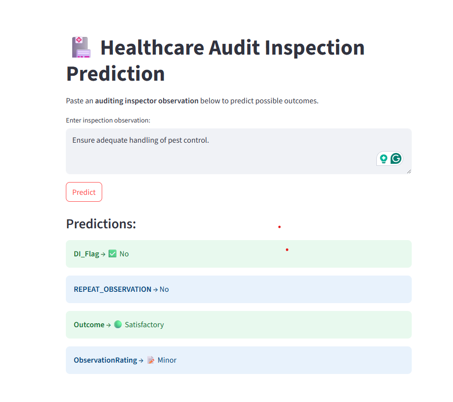

# 🏥 AuditSentinel: NLP-Based Prediction of Healthcare Inspection Outcomes

This project applies **Natural Language Processing (NLP)** and **Machine Learning** to predict outcomes of healthcare audit inspections based on the **auditor’s observation text**.

The system helps auditing teams anticipate key issues and outcomes **before final inspection decisions are made**, saving time and improving compliance monitoring.

---

## 📌 Problem Statements

From each inspector observation, we predict:

1. **DI_Flag** → Whether the issue relates to **Data Integrity** (`Yes` / `No`).  
2. **REPEAT_OBSERVATION** → Whether a **repeat inspection** is needed (`Yes` / `No`).  
3. **Outcome** → Final **inspection outcome** (`Satisfactory`, `Unsatisfactory`, `Needs Improvement`, `Good`, `Not Applicable`).  
4. **ObservationRating** → Severity rating (`Critical`, `Major`, `Minor`, `Recommendation`).  

---

## 🔎 Project Workflow

1. **Data Preprocessing**
   - Lowercasing, punctuation removal, stopword removal, regex cleaning.  
   - Label encoding of target variables.  
   - Example:  
     - `DI_Flag`: {"No": 0, "Yes": 1}  
     - `Outcome`: {"Satisfactory": 4, "Unsatisfactory": 1, "Needs Improvement": 2, "Good": 3, "Not Applicable": 0}  

2. **Feature Extraction**
   - Text converted to numerical features using **TF-IDF Vectorization**.

3. **Model Training**
   - For each problem, we trained **multiple candidate models** (Logistic Regression, Random Forest, SVM, Naive Bayes).  
   - Performance was evaluated using **Accuracy, Precision, Recall, F1 Score**.  
   - The **best performing model** was selected and saved.  
     - `DI_Flag` → **Logistic Regression**  
     - `REPEAT_OBSERVATION` → **Random Forest**  
     - `Outcome` → **Logistic Regression**  
     - `ObservationRating` → **Support Vector Machine (SVM)**  

4. **Model Saving**
   - Best models saved as `.pkl` files in `/models` directory.  
   - Shared **TF-IDF vectorizer** also saved.  

5. **Deployment**
   - A **Streamlit app** allows users to input an observation and view predictions for all 4 problem statements.
   - 

---

